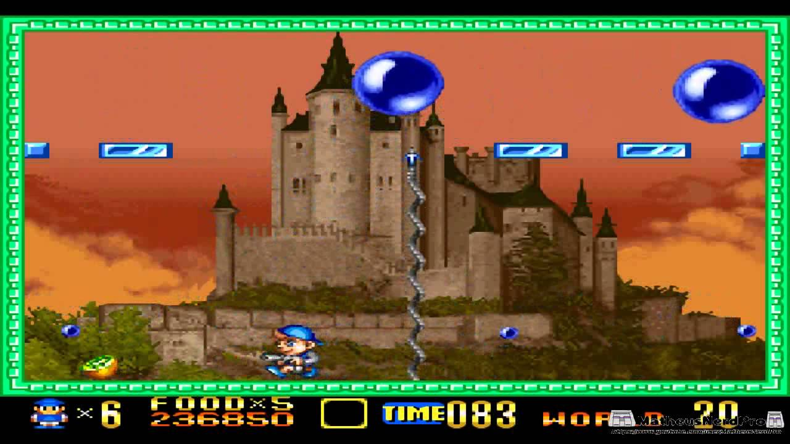

# Projeto Pang
### FPRO/MIEIC, 2019/20
### David Teixeira Preda (up201904726@fe.up.pt)
### 1MIEIC04

#### Objetivo

Criar um clone do jogo [Pang](https://en.wikipedia.org/wiki/Pang_(video_game)) (NES), usando também o [Bubble Trouble](https://www.miniclip.com/games/bubble-trouble/en/) como exemplo.

#### Descrição

O objetivo é eliminar as bolas do ecrã. Cada bola sub-divide-se em várias quando se dispara com ela. As bolas não podem bater no jogador.

#### UI

### Pacotes

- Pygame

#### Tarefas

1. **MATRIZ para os BLOCOS**
   1. blocos - 50x10 (done)
   1. 0 (vazio) 1 (bloco)
   1. desenhar (done)
1. **JOGADOR** DONE
   1. desenhar: coordenadas (resolução: 50x100) DONE
   1. mover teclas DONE
   1. impedir que bata nos blocos DONE
1. **BOLAS**
   1. desenhar (resolução: 12, 25, 50, 100): pos_x, pos_y, vel_x, vel_y DONE
   1. em cada ciclo, introduzir gravidade (vel_y += 10*dt) DONE
   1. quando atinge o solo, impulso (if pos_y > xx: pos_y = xx; vel_y += IMPULSO*tamanho) DONE
   1. quando atinge bloco, muda de direcção (vel_x = -vel_x)
   1. colisões com o jogador (bounding box) DONE
1. **TIROS**
   1. tecla: cria tiro em tiro_x, altura_tiro, existe_tiro DONE
   1. desenhar se existe_tiro DONE
   1. em cada ciclo, altura aumenta. quando atinge o tecto, existe_tiro=False DONE
1. **FUTURO:**
   * Multi-jogador DONE
   * diferentes tipos de tiro
#### Notas:
1. A matriz não foi feita da forma originalmente planeada.
1. O jogador ficou com uma resolução diferente, devido ao tamanho das imagens.
1. **BÓNUS** Foram feitas animações para o jogador e feitas algumas diferenças em comparação aos comandos originais do jogo.
1. A gravidade das bolas não é propriamente real de forma a subirem sempre o mesmo, havendo um impulso quando atingem o chão.
1. Como planeado, as colisão são detetadas através de bounding boxes.
1. Os diferentes tipos de tiro não foram implementados.
1. Apesar de ser opcional, foi criado um modo multijogador.
1. Comandos:
   1. Player1 - Arrow_Left: esquerda; Arrow_Right: direita; Arrow_Down: tiro;
   1. Player2 - A: esquerda; D: direita; S: tiro.
### 19/nov/2019
